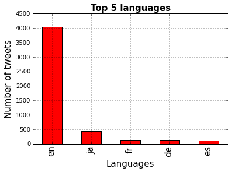

    import re
    import dill
    import json
    import string
    import numpy as np
    import pandas as pd
    import matplotlib.pyplot as plt
    from nltk.corpus import stopwords
    from sklearn.decomposition import NMF
    from nltk.stem import WordNetLemmatizer
    from sklearn.feature_extraction.text import TfidfVectorizer
    from sklearn.feature_extraction.text import CountVectorizer
    
    %matplotlib inline

## Import Datastream Json Objects

'twitter_streaming.txt' was created by twitter_stream.py.

Run command 'python twitter_stream.py > twitter_streaming.txt'
to generate your own data.

    tweets_data_path = 'twitter_streaming.txt'
    
    tweets_data = []
    tweets_file = open(tweets_data_path, "r")
    
    for line in tweets_file:
        try:
            tweet = json.loads(line)
            #Check if valid tweet containing text
            if tweet['text']:
                tweets_data.append(tweet)
        except:
            continue

    #Working with 21MB of data and fifty-three hundred tweets from about 4 hours of scraping
    print len(tweets_data)

    5385

    tweets = pd.DataFrame()

###Extract data from json to Pandas  DataFrame

    tweets['text'] = map(lambda tweet: tweet['text'], tweets_data)
    tweets['lang'] = map(lambda tweet: tweet['lang'], tweets_data)
    tweets['timestamp'] = map(lambda tweet: tweet['timestamp_ms'], tweets_data)
    tweets['retweet_count'] = map(lambda tweet: tweet['retweet_count'], tweets_data)
    tweets['hashtags'] = map(lambda tweet: tweet['entities']['hashtags'], tweets_data)
    tweets['geo'] = map(lambda tweet: tweet['geo'], tweets_data)

###EDA

####Topic
The purpose of this analysis is to analyze the twitter stream to
determine the trending high-level programming languages. For the
purpose of this analysis, Python and Javascript were tracked.

Running twitter_stream.py for about 4-5 hours provided 5385 tweets.

    tweets_by_lang = tweets['lang'].value_counts()
    
    fig, ax = plt.subplots()
    ax.tick_params(axis='x', labelsize=15)
    ax.tick_params(axis='y', labelsize=10)
    ax.set_xlabel('Languages', fontsize=15)
    ax.set_ylabel('Number of tweets' , fontsize=15)
    ax.set_title('Top 5 languages', fontsize=15, fontweight='bold')
    tweets_by_lang[:5].plot(ax=ax, kind='bar', color='red');

    def word_in_text(word, text):
        """Regex search for keyword in input text returning boolean."""
        word = word.lower()
        text = text.lower()
        match = re.search(word, text)
        if match:
            return True
        return False

    #Identify tweets containing the keywords in the tweet textbody
    tweets['Python'] = tweets['text'].apply(lambda tweet: word_in_text('Python', tweet))
    tweets['Javascript'] = tweets['text'].apply(lambda tweet: word_in_text('Javascript', tweet))

    #Checking tweet counts to verify both are present
    print 'Python Tweet Counts:     ', tweets['Python'].value_counts()[True]
    print 'Javascript Tweet Counts: ', tweets['Javascript'].value_counts()[True]

    Python Tweet Counts:      1672
    Javascript Tweet Counts:  3122

####Exploritory Analysis to see if there are any common subtopics about these languages 

    #See if context is coding bootcamps
    tweets['Bootcamp'] = tweets['text'].apply(lambda tweet: word_in_text('Bootcamp', tweet))
    print tweets.Bootcamp.value_counts()[True]

    3

    #Are people talking about online courses they took?
    tweets['MOOC'] = tweets['text'].apply(lambda tweet: word_in_text('MOOC', tweet))
    print tweets.MOOC.value_counts()[True]

    1

    #Do they need a job?
    tweets['Hiring'] = tweets['text'].apply(lambda tweet: word_in_text('Hiring', tweet))
    print tweets.Hiring.value_counts()[True]

    133

    #Are they advertizing an opening?
    tweets['Jobs'] = tweets['text'].apply(lambda tweet: word_in_text('Jobs', tweet))
    print tweets.Jobs.value_counts()[True]

    526

    #Talking about it on their resume
    tweets['Resume'] = tweets['text'].apply(lambda tweet: word_in_text('Resume', tweet))
    print tweets.Resume.value_counts()[True]

    9

    #Generically talking about coding in the language
    tweets['Coding'] = tweets['text'].apply(lambda tweet: word_in_text('Coding', tweet))
    print tweets.Coding.value_counts()[True]

    66

    #Retweet information not provided to client
    tweets.retweet_count.max()

    0

    #Are the tweets geo-tagged
    print tweets.geo.loc[tweets.geo.notnull()].count()

    7

###Content extraction
The word search revealed that tweets tied to the hiring process were most common.
Tweets with the words 'hiring' and 'jobs' having the highest frequency.  
To look at the the most important concepts of these tweets, the next section will analyze and create word grouping using clustering with 
Non-negative Matrix Factorization. To run the term frequency calculations,
only the English language tweets were considered.

    #select english stopwords to remove from term frequency calculation
    cachedStopWords = set(stopwords.words("english"))
    #add custom words for slang and common abreviations
    cachedStopWords.update(('and','I','A','And','So','arnt','This','When','It',\
                            'many','Many','so','cant','Yes','yes','No','no',\
                            'These','these','',' ','ok','na', 'edit','idk',\
                            'gon','wasnt','yt','sure','watch','whats','youre',\
                            'theyll','anyone'))

    def lemmatizer(text):
        """Lemmatize all words in tweet texts to eliminate non-words and 
           return the word stems."""
        text = text.lower()
    
        stemmer = WordNetLemmatizer()
        text = text.encode('ascii', 'ignore')
        text = text.translate(string.maketrans("",""), string.punctuation)
    
        stop = stopwords.words('english')
        words = [stemmer.lemmatize(word) for word in text.split() if word not in stop]
    
        return ' '.join(words)
    
    tweets['words'] = tweets.text.apply(lambda x: lemmatizer(x))

    #Run TF-IDF to get word frequencies across tweets
    vectorizer = TfidfVectorizer(stop_words=cachedStopWords)
    tweets['tf_text'] = vectorizer.fit_transform(tweets.words)

    #Run Niave Bayes model sentiment binary classifier
    #See 'create_sentiment_model.py' for pickle creation.
    with open('sentiment_clf_full.pkl', 'rb') as pk:
        clf = dill.load(pk)

    tweets['sentiments'] = tweets.words.loc[tweets.lang == 'en'].apply(lambda x: clf.classify(x));
    print tweets.sentiments.value_counts()
    tweets.sentiments = tweets.sentiments.apply(lambda x: 1 if x=='pos' else -1)

    pos    4034
    dtype: int64

    print "Pos/Neg counts for Python: "
    print tweets.loc[tweets.Python == True]['sentiments'].value_counts()
    print 
    print "Pos/Neg counts for Javascript: "
    print tweets.loc[tweets.Javascript == True]['sentiments'].value_counts()

    Pos/Neg counts for Python: 
     1    1242
    -1     430
    dtype: int64
    
    Pos/Neg counts for Javascript: 
     1    2433
    -1     689
    dtype: int64

    def NMF_tkn_words(X, n_features=10000, n_topics=4, n_top_words=4,\
                      random_state=1):
        """
            Non-negative matrix factorization to group tokenized words into
            topic clusters.
        """
    
        n_samples = X.shape[0]
        #select english stopwords
        cachedStopWords = set(stopwords.words("english"))
        #update list
        cachedStopWords.update(('and','I','A','And','So','arnt','This','When','It',\
                                'many','Many','so','cant','Yes','yes','No','no',\
                                'These','these','',' ','ok','na', 'edit','idk',\
                                'gon','wasnt','yt','sure','watch','whats','youre',\
                                'theyll','anyone'))
    
        vectorizer = TfidfVectorizer(stop_words=cachedStopWords)
        X = vectorizer.fit_transform(X).toarray()
    
        # Fit the NMF model
        print("Fitting the NMF model with n_samples=%d and n_features=%d..."
              % (n_samples, n_features))
    
        nmf = NMF(n_components=n_topics, random_state=random_state).fit(X)
        feature_names = vectorizer.get_feature_names()
    
        for topic_idx, topic in enumerate(nmf.components_):
            print("Topic #%d:" % topic_idx)
            print(" ".join([feature_names[i]\
                            for i in topic.argsort()[:-n_top_words - 1:-1]]))
    
        return feature_names

    def words_in_text(word_list, text):
        """Regex search for keyword in input text returning boolean."""
        text = text.lower()
        for ix,word in enumerate(word_list):
            word = word.lower()
            match = re.search(word, text)
            if match:
                return True
            elif ix < len(word_list):
                continue
            else:
                return False

    tweets['jobs_hiring'] = tweets['words'].apply(lambda tweet: words_in_text(['Hire','Job','Hiring','Jobs'], tweet))
    print tweets.jobs_hiring.value_counts()[True]

    717

    #Word clusters for companies hiring for Javascript skills
    print NMF_tkn_words(tweets.words.loc[tweets.jobs_hiring == True].loc[tweets.Javascript == True])[0]

    Fitting the NMF model with n_samples=535 and n_features=10000...
    Topic #0:
    newyork javascriptphp technology system
    Topic #1:
    startupjobs coder hyderabad hardcore
    Topic #2:
    gesucht html meteorjs cs
    Topic #3:
    job javascript developer looking
    00175

    #Word clusters for companies hiring for Python skills
    print NMF_tkn_words(tweets.words.loc[tweets.jobs_hiring == True].loc[tweets.Python == True], n_top_words=10)[0]

    Fitting the NMF model with n_samples=107 and n_features=10000...
    Topic #0:
    devops cs html hale group amp admin ltd vikasjee linux
    Topic #1:
    job python engineer career software hiring developer senior javascript mysql
    Topic #2:
    posted want httpstcoj ageis opportunity ninja securityminded securedrop work rt
    Topic #3:
    making front quantitative desk office market looking developer job python
    01601

-----------------------------------------------------------------------------------------------------------------
The difference between the word clusters shows up quite distinctly. The most commonly used words in Javascript job tweets talk about skills and application to specific web applications. Words such as php/html showed up regularly with Javascript. 

But when looking at the Python job tweets, the story was focused differently. Gone was most of the talk about programming packages. Instead, the talk was about the company hiring or secondary 'soft' skills.  This test seems to reveal that the hiring managers who are posting these tweets do not have a consistent vocabulary when looking for candidates.

    
